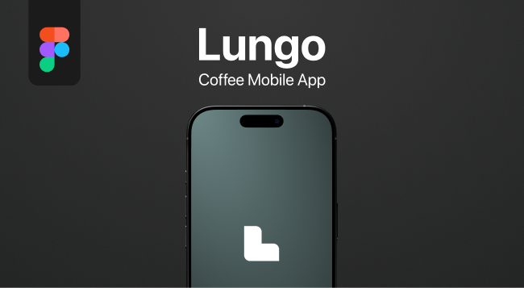
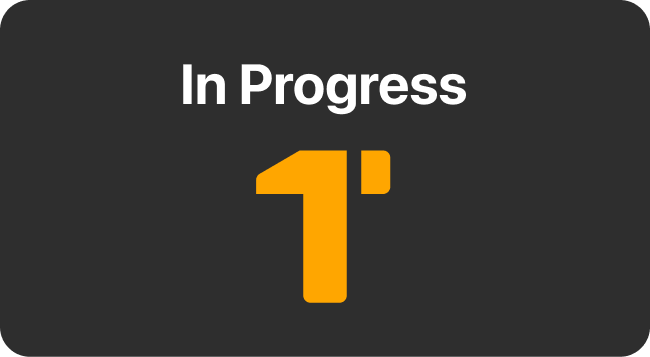

<!-- Banner do Perfil -->

### 
Igor Murai | Product Designer - UX/UI

### 
Objetivo Profissional

  Busco estágio em Product Design, com foco em UX/UI, prototipação e usabilidade. Tenho experiência com Figma, Design Thinking e conhecimento em HTML/CSS, colaborando com equipes de design e desenvolvimento para criar produtos digitais centrados no usuário.

### 
Ferramentas

  

### 
Projetos UX/UI

  <!-- Projeto Lungo -->
  
  &nbsp;&nbsp;&nbsp;&nbsp;
  
  <!-- Projeto em andamento -->
  

  <strong>Lungo Coffee Mobile App</strong>
  &nbsp;&nbsp;&nbsp;&nbsp;&nbsp;&nbsp;&nbsp;&nbsp;
  <strong>Spotify Redesign</strong>

### 
Formações e Certificações

  <strong>- Análise e Desenvolvimento de Sistemas</strong> – IFSP 
  <strong>- UX Design</strong> – Coursera / Google 
  <strong>- Figma: Design de Interfaces do Zero ao Profissional</strong> – Udemy

### 
Onde Me Encontrar

  <!-- Botão Behance Redondo -->

  
  &nbsp;
  

